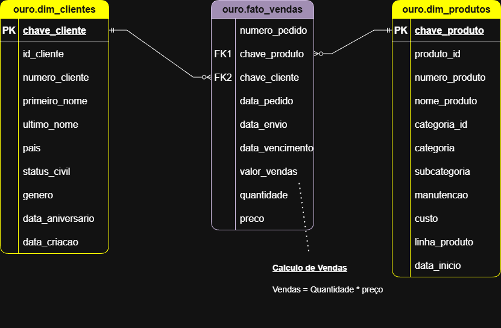
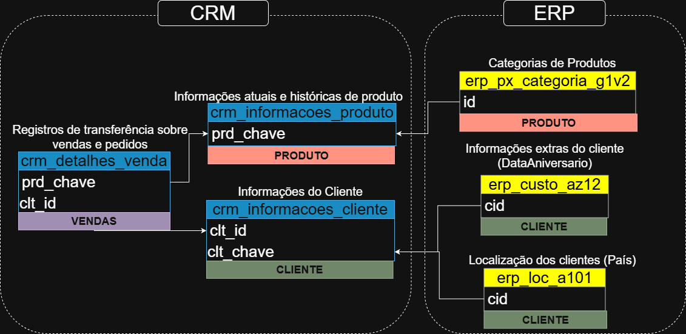

# projeto-sql-data-warehouse
Construção moderna de um DW (Data Warehouse) com SQL Server, incluindo processo de ETL, Modelagem de Dados e Analise.


A arquitetura de dados para este projeto segue as camadas Bronze, Prata e Ouro da Arquitetura Medallion:


1. Camada Bronze: Armazena os dados brutos tal como estão, provenientes dos sistemas de origem. Os dados são importados de arquivos CSV para um banco de dados SQL Server.
2. Camada Prateada: Esta camada inclui processos de limpeza, padronização e normalização de dados para preparar os dados para análise.
3. Camada de Ouro: Armazena dados prontos para uso comercial, modelados em um esquema em estrela, necessários para geração de relatórios e análises.

Diagrama de Fluxo de dados: 


Modelagem de dados: 


Modelo de Integração: 



# Visão geral do projeto

Este projeto envolve:

1. Arquitetura de Dados: Projetar um Data Warehouse moderno usando a arquitetura Medallion nas camadas Bronze, Prata e Ouro.
2. Pipelines ETL: Extrair, transformar e carregar dados de sistemas de origem para o data warehouse.
3. Modelagem de Dados: Desenvolver tabelas de fatos e dimensões otimizadas para consultas analíticas.
4. Análise e Relatórios: Criar relatórios e dashboards baseados em SQL para insights acionáveis.
5. Observação: Toda a modelagem foi feita no software Draw.io, uma ferramenta gratuita e open source 

## Estrutura do Repositório

```text
projeto-sql-data-warehouse/
│
├── datasets/                    # Conjuntos de dados brutos utilizados no projeto (dados de ERP e CRM)
│
├── docs/                        # Documentação do projeto e detalhes da arquitetura
│   ├── etl.drawio               # O arquivo Draw.io mostra todas as diferentes técnicas e métodos de ETL.
│   ├── data_architecture.drawio # O arquivo Draw.io mostra a arquitetura do projeto.
│   ├── data_catalog.md          # Catálogo de conjuntos de dados, incluindo descrições de campos e metadados.
│   ├── data_flow.drawio         # Arquivo Draw.io para o diagrama de fluxo de dados
│   ├── data_models.drawio       # Arquivo Draw.io para modelos de dados (esquema em estrela)
│   └── naming-conventions.md    # Diretrizes consistentes para nomenclatura de tabelas, colunas e arquivos.
│
├── scripts/                     # Scripts SQL para ETL e transformações
│   ├── bronze/                  # Scripts para extrair e carregar dados brutos
│   ├── prata/                   # Scripts para limpeza e transformação de dados
│   └── ouro/                    # Scripts para criação de modelos analíticos
│
├── README.md                    # Visão geral do projeto
```

# Sobre mim:

Sou Matheus Costa Rodrigues, profissional de TI e apaixonado por integrações de dados e Engenharia de Dados.

Criei este projeto como forma de aprendizado, portfólio e também para compartilhar conhecimento com quem está estudando ou já atua na área. Aqui eu mostro, de forma prática, uma visão bem estruturada de Engenharia de Dados, explicando desde as funções utilizadas nas transformações, até como cada etapa do processo de ETL acontece na prática.

A ideia é deixar tudo o mais claro e didático possível pela documentação completa, seguindo boas práticas e mostrando como os dados percorrem todo o caminho, da origem até o destino final.